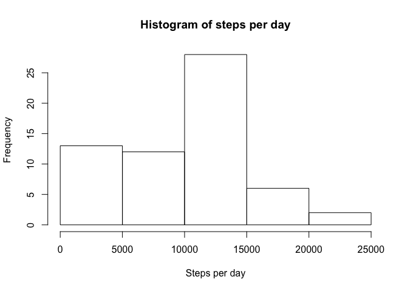
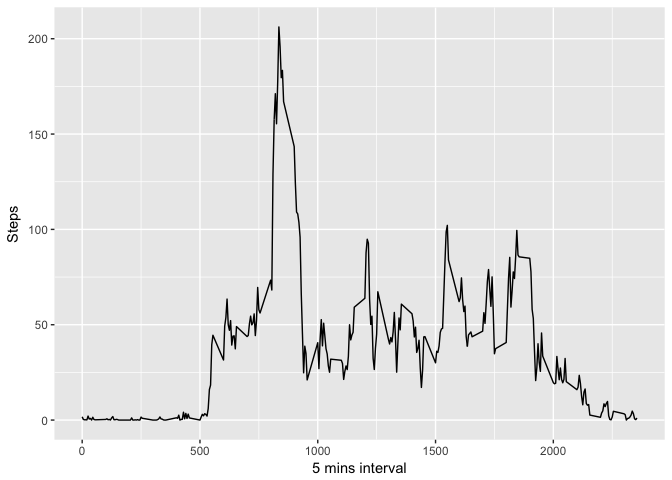
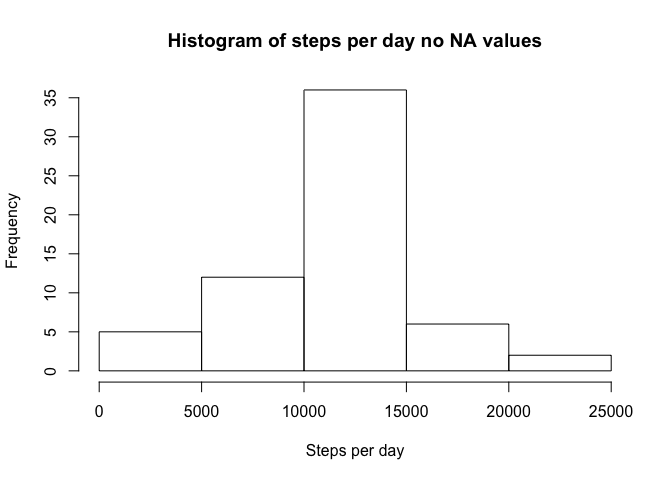
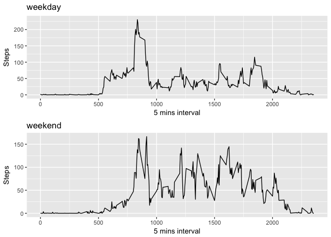

# Reproducible Research: Peer Assessment 1


## Loading and preprocessing the data

```r
data_file = "activity.zip"
# Check if the data file is present
if (!file.exists(data_file)) {
  # If not then download it
  download_link = "https://d396qusza40orc.cloudfront.net/repdata%2Fdata%2Factivity.zip"
  download.file(download_link,data_file)
}
# Unzip the data file
unzip(data_file)
# Load into our frame
step_data <- read.csv("activity.csv",header=TRUE)
```


## What is mean total number of steps taken per day?

```r
total_steps_per_day <- aggregate(step_data$steps,by=list(date=step_data$date),FUN=sum,na.rm =TRUE)
hist(total_steps_per_day$x,right = FALSE,main = "Histogram of steps per day",xlab="Steps per day")
```

<!-- -->

```r
# Calculate mean & median 
mean_steps_per_day <- mean(total_steps_per_day$x)
median_steps_per_day <- median(total_steps_per_day$x)
```

The mean steps per day is **9354.2295082** and the median is **10395** 

## What is the average daily activity pattern?

```r
mean_interval <- aggregate(step_data$steps,by=list(interval=step_data$interval),FUN=mean,na.rm=TRUE)
require(ggplot2)
```

```
## Loading required package: ggplot2
```

```
## Warning: package 'ggplot2' was built under R version 3.3.2
```

```r
ggplot(data=mean_interval,aes(x=interval,y=x)) + geom_line() + ylab("Steps") + xlab("5 mins interval")
```

<!-- -->

```r
max_mean_step_interval <- mean_interval[which.max(mean_interval$x),]$interval
```
The 5 minutes interval that contains the maximum average steps is **835**

## Imputing missing values

```r
# Calculate the number of NA
na_count <- sum(is.na(step_data$steps))
# Make a copy of the original data frame
step_data_new <- step_data
# Change NA values by the mean of the 5 minutes interval
step_data_new$steps[is.na(step_data_new$steps)] <- mean_interval$x[match(step_data_new$interval[is.na(step_data_new$steps)],mean_interval$interval)]
total_steps_per_day_new <- aggregate(step_data_new$steps,by=list(date=step_data_new$date),FUN=sum,na.rm =TRUE)
hist(total_steps_per_day_new$x,right = FALSE,main = "Histogram of steps per day no NA values",xlab="Steps per day")
```

<!-- -->

```r
mean_steps_per_day_new <- mean(total_steps_per_day_new$x)
median_steps_per_day_new <- median(total_steps_per_day_new$x)
```
The mean steps per day is **1.0766189\times 10^{4}** and the median is **1.0766189\times 10^{4}** 

It seems that imputting missing values increases the mean/median values

## Are there differences in activity patterns between weekdays and weekends?

```r
# Multiple plot function
#
# ggplot objects can be passed in ..., or to plotlist (as a list of ggplot objects)
# - cols:   Number of columns in layout
# - layout: A matrix specifying the layout. If present, 'cols' is ignored.
#
# If the layout is something like matrix(c(1,2,3,3), nrow=2, byrow=TRUE),
# then plot 1 will go in the upper left, 2 will go in the upper right, and
# 3 will go all the way across the bottom.
#
multiplot <- function(..., plotlist=NULL, file, cols=1, layout=NULL) {
  library(grid)

  # Make a list from the ... arguments and plotlist
  plots <- c(list(...), plotlist)

  numPlots = length(plots)

  # If layout is NULL, then use 'cols' to determine layout
  if (is.null(layout)) {
    # Make the panel
    # ncol: Number of columns of plots
    # nrow: Number of rows needed, calculated from # of cols
    layout <- matrix(seq(1, cols * ceiling(numPlots/cols)),
                    ncol = cols, nrow = ceiling(numPlots/cols))
  }

 if (numPlots==1) {
    print(plots[[1]])

  } else {
    # Set up the page
    grid.newpage()
    pushViewport(viewport(layout = grid.layout(nrow(layout), ncol(layout))))

    # Make each plot, in the correct location
    for (i in 1:numPlots) {
      # Get the i,j matrix positions of the regions that contain this subplot
      matchidx <- as.data.frame(which(layout == i, arr.ind = TRUE))

      print(plots[[i]], vp = viewport(layout.pos.row = matchidx$row,
                                      layout.pos.col = matchidx$col))
    }
  }
}

# Add a new column ti the dataset representing the day of the week 0 = Sunday, 6 = Saturday
step_data_new$weekday <- format(as.Date(step_data_new$date),"%w") 
step_data_new$weekday[step_data_new$weekday == 0] <- "weekend"
step_data_new$weekday[step_data_new$weekday == 6] <- "weekend"
step_data_new$weekday[step_data_new$weekday == 1] <- "weekday"
step_data_new$weekday[step_data_new$weekday == 2] <- "weekday"
step_data_new$weekday[step_data_new$weekday == 3] <- "weekday"
step_data_new$weekday[step_data_new$weekday == 4] <- "weekday"
step_data_new$weekday[step_data_new$weekday == 5] <- "weekday"
step_data_week_day <- step_data_new[step_data_new$weekday == "weekday",]
step_data_week_end <- step_data_new[step_data_new$weekday == "weekend",]
mean_interval_week_day <- aggregate(step_data_week_day$steps,by=list(interval=step_data_week_day$interval),FUN=mean,na.rm=TRUE)
mean_interval_week_end <- aggregate(step_data_week_end$steps,by=list(interval=step_data_week_end$interval),FUN=mean,na.rm=TRUE)
p1 <- ggplot(data=mean_interval_week_day,aes(x=interval,y=x)) + geom_line() + ylab("Steps") + xlab("5 mins interval") + ggtitle("weekday")
p2 <- ggplot(data=mean_interval_week_end,aes(x=interval,y=x)) + geom_line() + ylab("Steps") + xlab("5 mins interval") + ggtitle("weekend")
multiplot(p1, p2, cols=1)
```

<!-- -->
